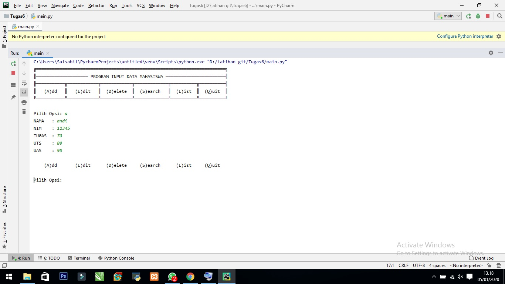
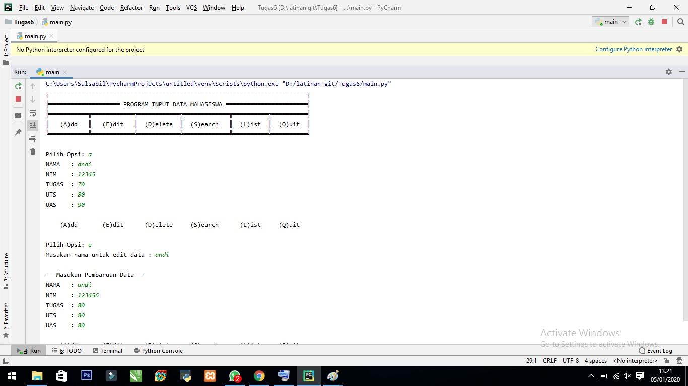
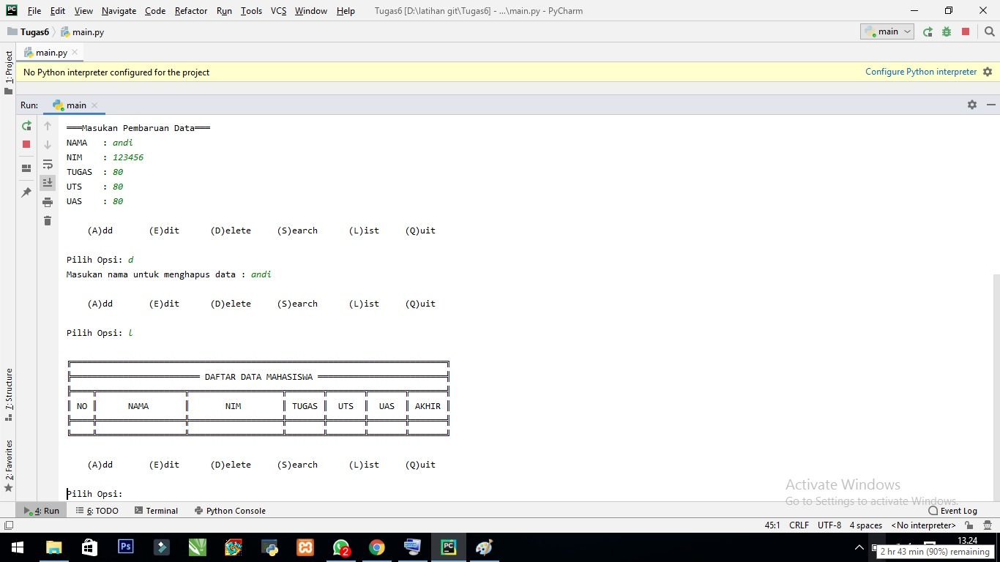
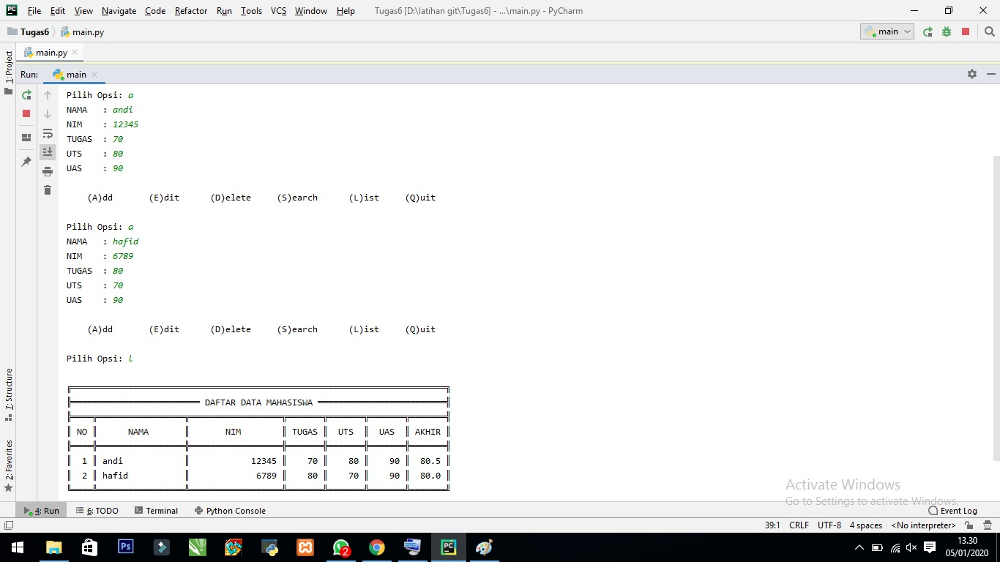

Tugas 6 Bahasa Pemrogramaan

Package dan Module

1.main.py berisi program utama untuk memanggil semua module yang ada

2.daftar_nilai.py berisi modul untuk

  tambah_data
  
  ubah data
 
 hapus data
  
  cari data
  
3.view_nilai.py berisi modul untuk

  cetak daftar nilai
  
  cetak hasil pencarian
  
4.input_nilai.py berisi modul untuk meminta user menginputkan data

Berikut hasil running dari program :
1. tambah data (add)

2. edit data (edit)

3. hapus data (delet)

4. daftar data (list)

